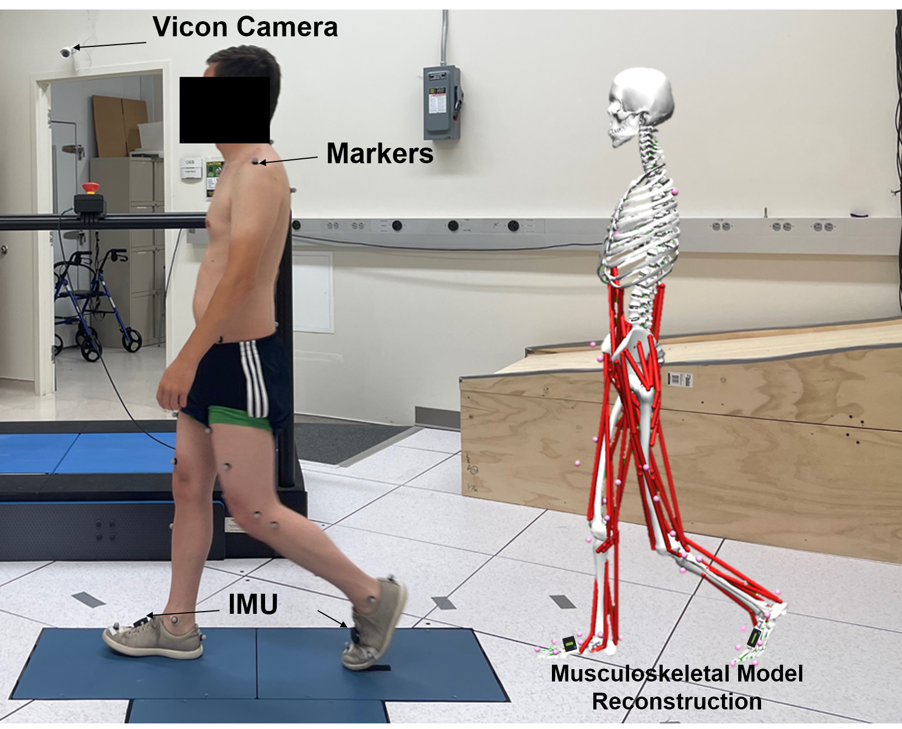
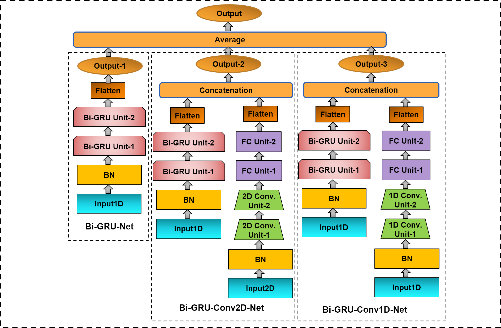
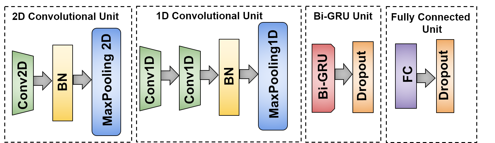

# Estimating Lower Extremity Joint Angles During Gait Using Reduced Number of Sensors Count Via Deep Learning
By Md Sanzid Bin Hossain, Hwan Choi, Zhishan Guo

## Summary

This repository contains the implementation of a deep learning framework for estimating lower extremity joint angles during gait using only two Inertial Measurement Unit (IMU) sensors mounted on the shoes. The method is designed to work across four walking conditions: treadmill, overground, stair, and slope, addressing the limitations of traditional lab-based motion capture systems.

### Experimental Setup



### Kinematics-Net


### Fundamental Units



## Key Features

- **Reduced Sensor Setup**: Unlike traditional approaches that require multiple sensors on various body segments, this method estimates joint angles with only two shoe-mounted IMUs, improving comfort and practicality for daily living.
- **Deep Learning Model**: The system leverages Gated Recurrent Units (GRU) and both 1D and 2D convolutional layers to create multiple sub-networks. The final model is constructed by averaging the outputs from these sub-networks in an end-to-end manner.
- **Multiple Walking Conditions**: The model is trained and evaluated under four different walking conditions: treadmill, overground, stair, and slope, making it robust and versatile for real-world applications.
- **Improved Accuracy**: The proposed method achieves up to **32.96% improvement** in Root Mean Square Error (RMSE) for joint angle prediction compared to baseline methods.

## Results

The extensive evaluations demonstrate that the proposed model significantly outperforms baseline approaches, making it a suitable solution for real-world applications in biomechanics and clinical gait analysis.


## Dataset

- Data for original Implementation with Keras Tensorflow: [Google Drive Link](https://drive.google.com/drive/folders/17uM_eZ8sstzeKAWtlEkhg06HDrRYaPCR?usp=sharing)
- Data for modified implementation in Pytorch: [Google Drive Link](https://drive.google.com/drive/folders/1nNotE2vVi0zEVXPmYzSC3NVl2aLD63Ob?usp=sharing)


## Codes
- [Code](ICDIP_Kinematics_Tensorflow_Keras_Implementation.py) for original implementation in Tensorflow Keras
- [Code](ICDIP_Kinematics_Net.ipynb) for modified implementation in Pytorch


## Citations
If you use the dataset in your research, please cite the following paper:

``` bibtex
@inproceedings{hossain2022estimating,
  title={Estimating lower extremity joint angles during gait using reduced number of sensors count via deep learning},
  author={Hossain, Md Sanzid Bin and Choi, Hwan and Guo, Zhishan},
  booktitle={Fourteenth International Conference on Digital Image Processing (ICDIP 2022)},
  volume={12342},
  pages={1116--1123},
  year={2022},
  organization={SPIE}
}

@article{moniruzzaman2021wearable,
  title={Wearable Motion Capture: Reconstructing and Predicting 3D Human Poses from Wearable Sensors},
  author={Moniruzzaman, Md and Yin, Zhaozheng and Hossain, Md Sanzid Bin and Guo, Zhishan and Choi, Hwan},
  journal={TechRxviz. Preprint},
  year={2021}
}

